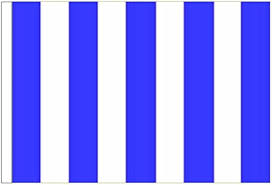
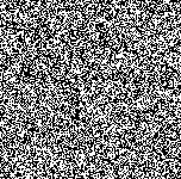
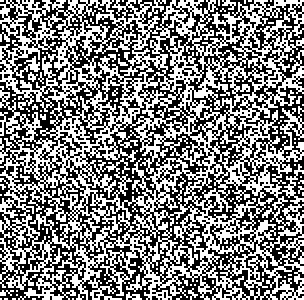
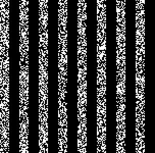

# 入力画像を視覚暗号にする

## 概要
  * 入力画像から2枚のシェア画像を作成する
  
## version
* python: 3.7.6
* numpy: 1.18.1
* opencv-python: 4.5.2.52

## 実行方法
* ライブラリのインストール\
'pip install -r requirements.txt'  
※ tkinterは環境によって別途インストールが必要です

* 実行\
'python main.py'

* 入力画像の選択\

* 出力画像のスケール入力\
    
## 結果
### 入力画像/設定値
* 入力画像

* スケール設定：0.5

### 出力結果
* share1

* share2

* share1とshare2を重ね合わせた画像

## 参考サイト
https://www.acompany.tech/privacytechlab/Visual-Secret-Sharing-Scheme